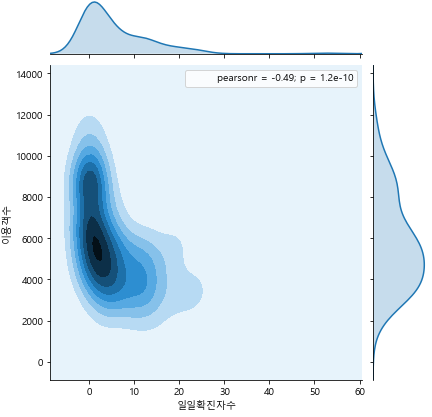
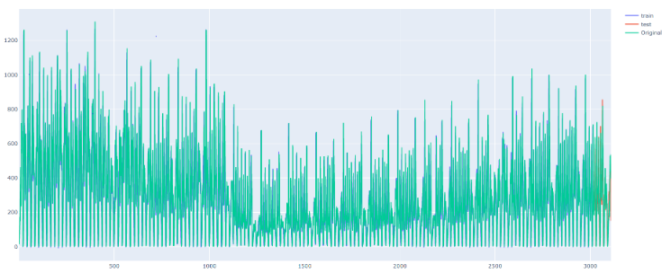

# 국토교통 빅데이터 온라인 해커톤 경진대회

> - 국토교통 빅데이터 온라인 해커톤 경진대회에 참가하였습니다.
>
> - 1번째 공모전 참가이기에 Python으로 전처리하는데도 어려움을 겪고 말았습니다...
>- 이번 공모전의 개인적인 목표는 프로젝트를 완벽하게 수행한다기보단, 전처리에서 예측까지 이루어지는 한 사이클을 무사히 마치고, 부족한 점을 보완하는데 있었습니다.

## 목표

- 국토교통 데이터와 코로나 데이터 등을 융합분석하여, 국민의 안전한 이동을 위한 새로운 통찰과 창의적 아이디어 도출
- 국토교통 데이터 활용 저변을 넓히고 국민적 관심도 제고
- 교통빅데이터 플랫폼을 통한 데이터 이용 활성화

- **Idea: 지하철 이용객수 예측을 통한 선제 방역 방법 제안**
- 2020-09-04 14:00 제출

## 진행 과정

### 1. Data Preprocessing & EDA

- 대회에서 제공한 내부데이터(한국철도공사 승하차 실적, Kaggle DS4C Team 코로나 확진자)와 외부데이터(날씨, 서울교통공사 지하철역 정보) 전처리 및 EDA 진행
  - 데이터가 굉장히 방대했기에 몇몇 결측값은 단순 대치 혹은 비조건부 평균 대치를 하였다.

  - 1번째 공모전이다보니 Python 자체가 서툴러서 Model Training까지 가는데 시간이 너무 오래 걸렸다...

  - 지하철역 이용객수와 코로나 확진자수는 하기 그림과 같이 굉장히 밀접한 상관관계를 갖는다.

    

### 2. Modeling & Evaluation

- 아직 교육받지 않고 말로만 들었던 Random Forest와 LSTM을 활용하여 예측
- Random Forest를 이용하여 여러 상황(사회적 거리두기, 누적확진자, 일일확진자)에 따른 피처의 중요도를 예측
- 상기 과정에서 얻은 피처를 활용하여 서울역의 이용객수를 예측함.